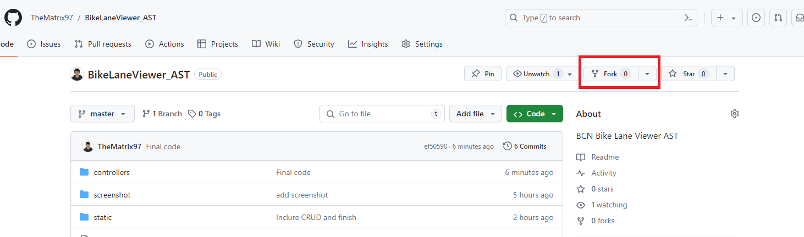
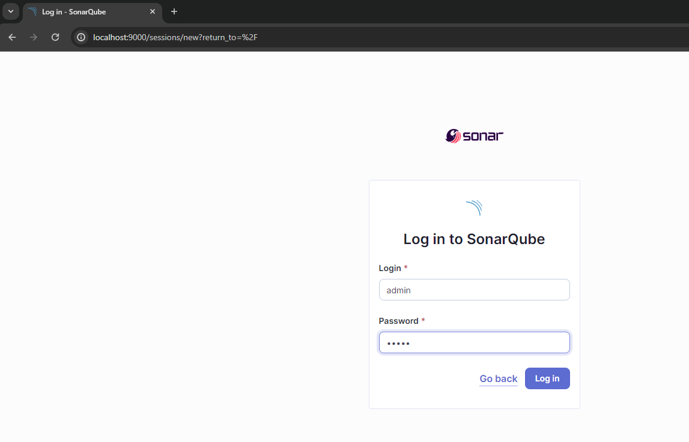
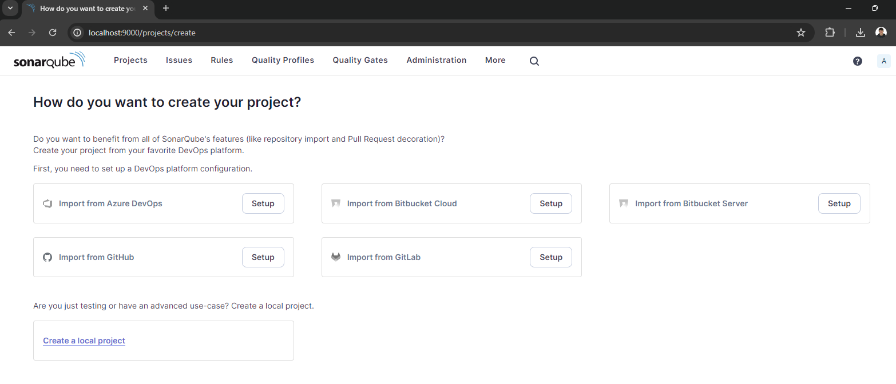
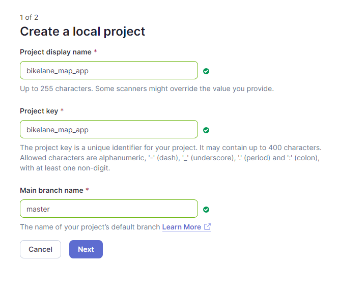
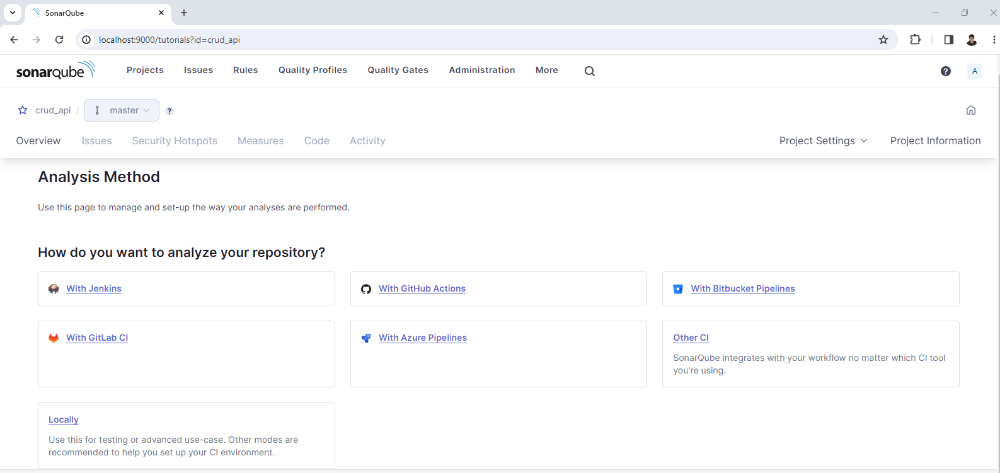
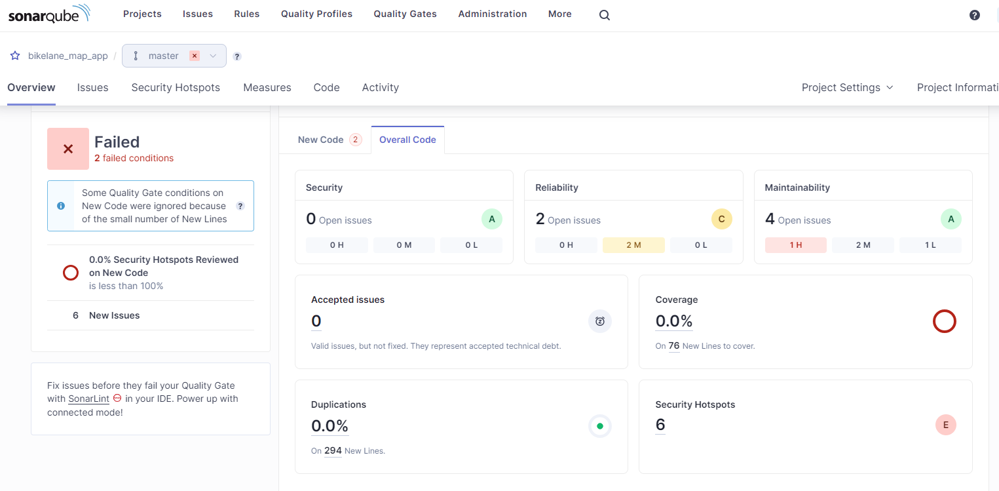

# LAB 1 - SAST

En este laboratorio, aprenderemos a usar la herramienta [SonarQube](https://www.sonarsource.com/products/sonarqube/) y las funcionalidades que incorpora en cuanto al análisis estático de código.
También veremos cómo utilizar la herramienta standalone CLI [Semgrep](https://github.com/returntocorp/semgrep).

Requisitos:

- [Docker](https://docs.docker.com/)
- [Git](https://git-scm.com/)
- [Postman](https://www.postman.com/) (Opcional)

## Clon del proyecto

Primero, haremos un fork y un clon del proyecto que analizaremos en esta práctica.
(<https://github.com/TheMatrix97/BikeLaneViewer_AST>)




```bash
git clone https://github.com/<Usuario>/BikeLaneViewer_AST
````


## SonarQube

```bash
docker network create -d bridge sonar_network
docker volume create sonar_data
docker run -d --name sonarqube -p 9000:9000 -v sonar_data:/opt/sonarqube/data --network sonar_network sonarqube:10.4-community
```

A continuación, abriremos un navegador y accederemos a `http://localhost:9000`. Donde deberíamos ver la pantalla de inicio de sesión de SonarQube



Accederemos con el usuario `admin`, contraseña `admin`. Nos pedirá cambiar la contraseña por una diferente y ya deberíamos ver el dashboard principal de la aplicación




### Creación del proyecto

Primero que todo, crearemos un proyecto nuevo manualmente, que hará referencia a nuestra API. Haciendo clic en la opción `Create a local project`

En este ejemplo, le indicaremos el nombre y clave de proyecto `bikelane_map_app`, definiendo la rama `master` como la principal del proyecto




A continuación le indicaremos que detecte cualquier cambio como código nuevo, con la opción `Use the global setting`

Si todo ha ido bien, ahora deberíamos ver la vista del proyecto vacía



### Generación del API Token

Para poder ejecutar el `sonar-scanner` deberemos generar un token de análisis, para hacerlo, deberemos acceder a la sección de seguridad y generar un token global, que nos permitirá analizar cualquier proyecto


**¡Apunta el Token en un Bloc de notas!** No se volverá a mostrar...

### Análisis de código

En este punto, ya podemos ejecutar el primer escaneo de código. Debemos tener en cuenta que SonarQube dispone de diferentes escáneres especializados, según la herramienta que usemos para compilar el proyecto:
- Gradle
- .NET
- Maven
- Ant

y uno genérico `SonarScanner`. Según el proyecto, nos puede interesar usar el escáner específico, ya que nos proporcionará más información que el genérico.

Para más información puedes consultar la documentación de SonarQube referente a los [Scanners](https://docs.sonarsource.com/sonarqube/9.9/analyzing-source-code/scanners/sonarscanner/).

En nuestro caso, como la aplicación está programada en JavaScript con `NodeJS`, utilizaremos la imagen por defecto de [sonnar-scanner-cli]((https://hub.docker.com/r/sonarsource/sonar-scanner-cli))


Solo deberemos reemplazar los siguientes parámetros:

- **$HOST**: `http://sonarqube:9000` -> (Host local)
- **$TOKEN**: `sqa_*` -> (Token de autenticación que hemos obtenido en el paso anterior)
- **$KEY**: `bikelane_map_app` -> (Identificador del proyecto)
  
```bash
cd BikeLaneViewer_AST
docker run --rm \
    -e SONAR_HOST_URL="$HOST" \
    -e SONAR_SCANNER_OPTS="-Dsonar.projectKey=$KEY" \
    -e SONAR_TOKEN="$TOKEN" \
    -v "${PWD}:/usr/src" --network sonar_network \
    sonarsource/sonar-scanner-cli
```

Si todo ha ido bien, deberíamos ver el siguiente output:

```txt
....
INFO: ANALYSIS SUCCESSFUL, you can find the results at: http://sonarqube:9000/dashboard?id=bikelane_map_app
INFO: Note that you will be able to access the updated dashboard once the server has processed the submitted analysis report
INFO: More about the report processing at http://sonarqube:9000/api/ce/task?id=5d2ef6ea-1dbb-47a1-920b-e464e4f1210d
INFO: Analysis total time: 37.405 s
INFO: ------------------------------------------------------------------------
INFO: EXECUTION SUCCESS
INFO: ------------------------------------------------------------------------
INFO: Total time: 43.180s
INFO: Final Memory: 22M/80M
INFO: ------------------------------------------------------------------------
```

Como puedes ver en el dashboard, tenemos 5 `Security Hostspots` que deberíamos revisar para ver si pueden ser problemas de seguridad.
¿Qué problemas tiene este código?



## Semgrep

Semgrep se distribuye como una herramienta CLI mediante PyPI, en nuestro caso, usaremos la [imagen Docker oficial](), así nos ahorramos la instalación de la herramienta.

```bash
docker pull returntocorp/semgrep
```

Si ejecutamos el comando help, deberíamos ver el `usage` de la herramienta CLI

```bash
docker run --rm returntocorp/semgrep semgrep --help
```
```txt
Usage: semgrep [OPTIONS] COMMAND [ARGS]...
```

Ejecutamos la herramienta de escaneo en [modo offline](https://semgrep.dev/docs/getting-started/), mapeando el contenido del proyecto al path `/src`

```bash
docker run --rm -v ${PWD}:/src returntocorp/semgrep semgrep scan --config=auto
```

**¿Qué vulnerabilidades has encontrado? ¿Más o menos que en SonarQube?**


# Limpieza

Limpia los recursos desplegados en este workshop:

- Sonarqube

```bash
docker stop sonarqube
docker rm sonarqube
docker network rm sonar_network
docker rmi sonarqube:10.4-community
```

- Semgrep

```bash
docker rmi returntocorp/semgrep
```